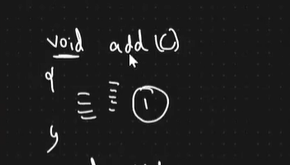
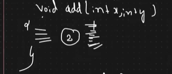
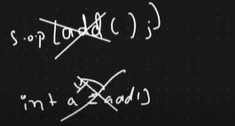
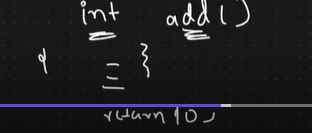
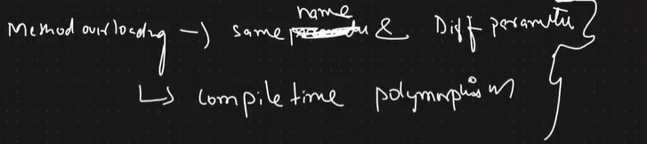
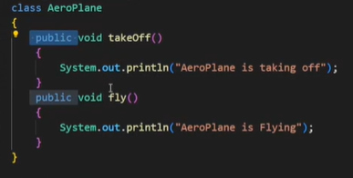
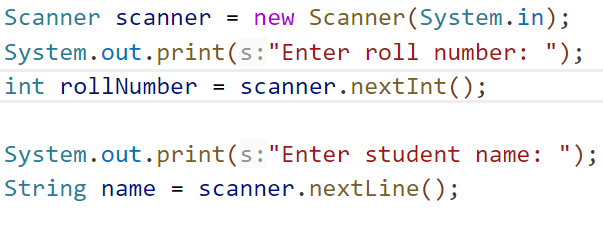
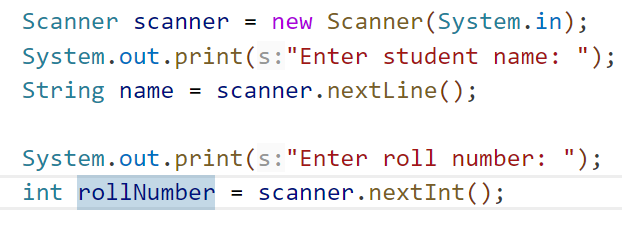

# step to use mark down- heading1
>>  imp note
## heading 2
**most impotant word**
## code  writing 
 ```java
  class pro{

  }
 ```


*** when you create  other class like ``Innermixed_concept`` do not write public , it write only in main mehtod ***
eg,`` wrong method `` 
   ```java
   
 **public** class Innermixed_concept {
 
       public void play(int a){
    }
}
           
public class mixed_concept {
    
    public static void main(String[] args) {
           
    }
}
   ```
   eg, ``right method`` 

   ```java
 
  class Innermixed_concept {
 
       public void play(int a){
    }
}
           
public class mixed_concept {
    
    public static void main(String[] args) {
           
    }
}

   ```
  

# 1. array to string  convert print as it is : Arrays.toString()
        int arr[] = { 2, 3,4,5,6};
        System.out.println(Arrays.toString(arr));
        
 
 # 2. we canot call directly function in sout     
 eg:  
        int arr[] = { 7,8,3,1,2 , 4 ,6 ,3 };
               System.out.println(play(arr));  

 # 3. print first and last element : 
     a={1,2,3,4,5};
     int size=a.length;
System.out.println("First element of an array is" +a[0]);
System.out.println("Last element of an array is "+a[size-1]);

 # 4. return- console me output nahi deta 
    println- console me output deta hai 
   
    eg,
     public  static int play(){
        return 5; 
     }

     public static String boy(){
        return "mohan";

     }

     public static void main(String[] args){
        int a = play();
        String b = boy();
        System.out.println(a);
        System.out.println(b);
     }

### imp tag it is for sorting sortcut: 
``````java
static int sort(int arr[]){
  Arrays.sort(arr);
}
``````

 # Return 
  if two int, int return
  ``````java
public static  int[]  play(int n , int arr[]){

  
     int ohm1 = arr[arr.length-2] ;
     int ohm2 =  arr[1] ;
        
   return  new int[] {ohm1 ,ohm2};
   
}
  ``````
  or
  ``````java
static int[] getSumAndSub(int a, int b) 
    { 
        int[] ans = new int[2]; 
        ans[0] = a + b; 
        ans[1] = a - b; 
  
        // returning array of elements 
        return ans; 
    } 

     public static void main(String[] args) 
    { 
        int[] ans = getSumAndSub(100, 50); 
        System.out.println("Sum = " + ans[0]); 
        System.out.println("Sub = " + ans[1]); 
    } 
  ``````
  ## If returned elements are of different types

``````java
import javafx.util.Pair; 
  
class GfG { 
    public static Pair<Integer, String> getTwo() 
    { 
        return new Pair<Integer, String>(10, "GeeksforGeeks"); 
    } 
  
    // Return multiple values from a method in Java 8 
    public static void main(String[] args) 
    { 
        Pair<Integer, String> p = getTwo(); 
        System.out.println(p.getKey() + " " + p.getValue()); 
    } 
} 

``````

 ## Returning list of Object Class

 ``````java
import java.util.*; 
  
class GfG { 
    public static List<Object> getDetails() 
    { 
        String name = "Geek"; 
        int age = 35; 
        char gender = 'M'; 
  
        return Arrays.asList(name, age, gender); 
    } 
  
    // Driver code 
    public static void main(String[] args) 
    { 
        List<Object> person = getDetails(); 
        System.out.println(person); 
    } 
} 


 ``````

# CREATE AN EMPTY ARRAY
```java
int[] myArray = new int[3]

```   
# Remove Zeros from array
```java
int[] array = {0, 5, 6, 0, 0, 2, 5};
        int len = 0;
        for (int i=0; i<array.length; i++)
        {
            if (array[i] != 0)
                len++;
        }
       int[] newArray = new int[len];
        for (int i=0, j=0; i<array.length; i++){
            if (array[i] != 0) {
                newArray[j] = array[i];
                j++;
            }
        }
```
# creae an array using arrayList
``` java
ArrayList<String> cars = new ArrayList<>();
         cars.add("volvo");
         cars.add("hundai");
         cars.add("mahindra");
         System.out.println(cars);

```
output: 
 [volvo, hundai, mahindra]

 # if Array code me nahi hai but Arraylist/other-method ka use karke array bani hai vo console me hai uss array ka use kaise kare ?
 or 
 ## add array  using for each loop
   *** for each loop ***
   ```java
    int SumEven =0;
    // s1 is a terminal based array
   for(int even : s1){
                  SumEven = SumEven + even;
             }
  ```
## add  array using loop
```java

             int arr[] = { 2,3,4,5,6};
           int sum =0;
           for(int i=0; i<arr.length;i++){
              sum = sum + arr[i];
            }
            System.out.println( sum);
            
```

# imp point to be noted 
 *** genral kg-1 :instantiate = obje creartion ***

 *** general kg-2 : Method and variable store hote hain stack ke andar jab kisi method ya variable ka kam complete ho jata hai to usse delete kar deya jata hai , fir usse koi refer nahi karta hai garbge bahiya usse  heap area me store value ko delete kar dete hai  ***

*** general kg-3 : ***

 

 

1.add() cannot call in sop 

 2. canot store in  any type of data variable  like    int a = add();  ***it is wrong ***

 3. method is not giving anything   it  give void  so thats why  we cantnot store in any variable . 
 
 

 *** general kg-4 ***
 
  
  we can store in  variable  becoZ it give me some output - int / if you are store in any variable that's fine you can direclty call .
  
    int s = add();
    or
    add();

 *** general kg-4 : ***


*** general kg-5 ***

  meaning of public :   in this project you can call anywhere this method 

>>  *** general kg-5 ***
   Scanner class  wrong  way :: 
   
   Scanner class  wrong  way :: 
   

>> kg-6
 for removing warning   use 
  ```java
  @SuppressWarnings("unused")
  ```
# String concept 
 > char convert into  string 
 ```java
 String s = "MADAM";
         String reverse = " ";
         for(int i=s.length()-1;i>=0;i--)
         {
            // char convert into  string 
             reverse  =   reverse + s.charAt(i);
         }
        System.out.println(reverse); 
  ```
  ### create array for character/string 
   HashSet<Character> seeout = new HashSet<>();
  ###  create array for string 
  ArrayList<Integer>  seeout = new ArrayList<>();

  ### How to compare two charcater array 
  Arrays.equals(s1arr, s2arr);

  ## How to convert string into char Array 
   String s1 = "listen";
   char s1arr[] =  s1.toCharArray();
  
# imp fact about array 
1. System.out.println(arr[]); -wrong
2. System.out.println(arr[i]);-print index
3.  System.out.println(arr);- print array  ( string case)
4. System.out.println(arr);- print garbage value [I@372f7a8d  ( int case)

# collection framework notes 
> 1. universal library add any library in your code just type 
   ```java
   import  java.util.*;
   ```